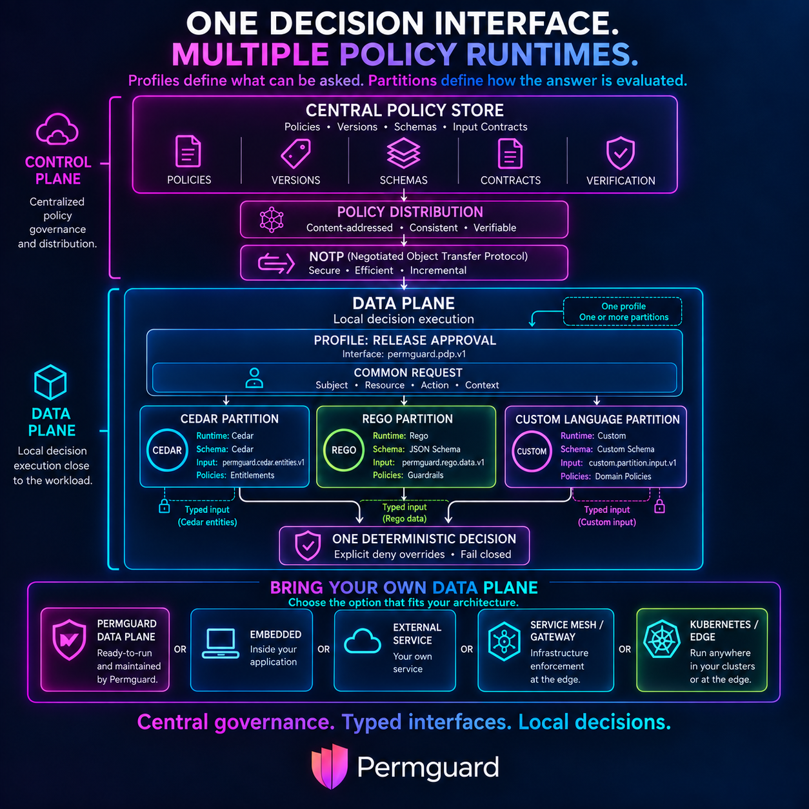

# Permguard

[](https://github.com/permguard/permguard/stargazers)
[](https://github.com/permguard/permguard/network/members)
[](https://github.com/permguard/permguard/issues)
[](https://github.com/permguard/permguard/pulls)
[](https://github.com/permguard/permguard/graphs/contributors)
[](https://github.com/permguard/permguard/blob/main/LICENSE)
[](https://x.com/intent/follow?original_referer=https%3A%2F%2Fdeveloper.x.com%2F&ref_src=twsrc%5Etfw%7Ctwcamp%5Ebuttonembed%7Ctwterm%5Efollow%7Ctwgr%5ETwitterDev&screen_name=Permguard)

<p align="center">
  
</p>

**Authorization policy, versioned like code and shipped like code.**

Permguard keeps your policies in a content-addressed, Git-like ledger, distributes signed
versions over a protocol built for it, and answers `can this subject do this to this?` —
either from its own data plane, or from **inside your process, at zero network cost**.

```text
       authors + CI                     ┌──────────────────┐
            │                           │  CONTROL  PLANE  │        the ledger
     permguard apply ────── NOTP ──────►│                  │   commits · trees · blobs
            │                           │  zones · ledgers │   signed heads · audit
            │                           └────────┬─────────┘
            │                                    │  NOTP: pull the objects,
            ▼                                    │  verify the signed head
    ┌───────────────┐                            │
    │   workspace   │                ┌───────────┴───────────┐
    │  manifest.yml │                ▼                       ▼
    │  cedar/ rego/ │       ┌─────────────────┐    ┌───────────────────────┐
    │  requests/    │       │   DATA  PLANE   │    │   YOUR  RUNTIME       │
    │  tests/       │       │  Permguard PDP  │    │  embed · sidecar      │
    └───────┬───────┘       │  HTTP · gRPC    │    │  same objects,        │
            │               └────────┬────────┘    │  same engines         │
    permguard test                   │             └───────────┬───────────┘
   (decide it offline,               └──────────┬──────────────┘
    no plane at all)                            │
                                       decisions + signed log
                                                │
                                                ▼
                                        back to the control plane,
                                        verifiable after the fact
```

## Why this is not another policy server

**Policy is a repository, not a blob.** `init`, `validate`, `plan`, `apply`, `pull`, `history` —
a workspace on disk, commits, trees and blobs, all content-addressed. A decision does not cite
"the policy that was live"; it cites the **exact commit** and the **identity of the policy** that
decided, and those identities survive a rename. You can check out the state a decision was made
against, months later, and re-ask the question.

**One question, many engines.** A ledger holds **partitions** — Cedar here, Rego there — and a
**profile** says which of them answer. `admin` consults the org chart *and* the guardrails;
`pipeline` consults the rules for machines and loads nothing else. An explicit deny from any
partition beats a permit from another, so "who is entitled" and "is it safe right now" can be
written by different people, in different languages, and still compose.

### Supported policy languages

| Language | Runtime | Decides from | Status |
| --- | --- | --- | --- |
| [Cedar](https://www.cedarpolicy.com) | `cedar` (`cedar-policy` 4.x) | the request | stable |
| [Rego](https://www.openpolicyagent.org/docs/policy-language) | `rego` (`regorus`) | the request | stable |
| [Dogwood](https://github.com/awslabs/dogwood) | `dogwood` (`amzn-dogwood-language`) | the request **and** a durable history | experimental |

A language is a **build**, not a deployment action: all three are compiled in. What a deployment
chooses is whether a ledger naming a runtime will be *served*, and the experimental one is gated —
see below.

### Experimental: Dogwood, and deciding from what has happened

Cedar and Rego answer *may this subject do this to this?* from the request in front of them.
[Dogwood](https://github.com/awslabs/dogwood) is Cedar plus **history**: a policy may ask what has
happened recently — `formerly`, `since`, aggregations over a window — as well as what is being
asked now.

```cedar
@id("read_only_after_login")
permit (principal, action == Drupe::Action::"Read", resource)
when temporal {
  formerly within 1h Drupe::Action::"Login"::response{ input.user: context.input.user }
};
```

Answering that takes a durable history, so Dogwood is served through a second interface,
`permguard.api.pdp.temporal.v1alpha1`: an occurrence is recorded into a hash-chained journal, made
durable, observed, and only then decided against. Upstream supplies the language, its lowering to
Cedar, validation and the per-request authorizer, and is explicit that its included interpreter is a
**reference** implementation rather than a production one. Permguard supplies what a deployment
needs around it — the policy lifecycle, multi-tenancy, a durable and bounded event history,
provenance, replication, limits and operational safety.

It is **experimental**, and gated by two switches that must both be set:

```yaml
experimental:
  dogwood:
    enabled: "true"        # this deployment accepts a contract that is not yet stable

dataPlane:
  events:
    enabled: "true"        # this plane keeps a durable event history
    producer_id: data-plane-eu-1
```

Saying one and not the other refuses to start, by name. `v1alpha1` is honest: the wire and
replication shapes may still change, and the switch is what makes accepting that a decision rather
than a default that moved.

Working configurations ship as `config.local-dogwood.yml` beside each server crate, and
[`examples/dogwood-session-access`](https://github.com/permguard/permguard/tree/main/examples/dogwood-session-access) is a whole ledger — schemas,
policies, and a test that asserts the verdicts its README claims. The contract is documented under
[Temporal Interface](https://community.permguard.com/docs/0.1.x/data-plane/temporal-interface).

**Bring your own data plane.** The objects are self-describing and the engines are a library.
Run Permguard's data plane, or pull the ledger and evaluate **in your own process** — no PDP hop,
no network on the decision path, the same manifest, the same engines, the same answer.
`permguard test` is that path, in the CLI: it decides a workspace off disk, before anything is
pushed anywhere.

**NOTP, not "an API".** Policy distribution is content-addressed transfer with negotiation — send
what the other side is missing, and nothing else — over HTTP or gRPC, with a **signed head** at
the end of it. A data plane refuses a ledger whose head it cannot verify, and refuses one whose
engine range it is outside: an engine interpreting the same policies differently is a silent
authorization bypass, not a compatibility note.

**Decisions are evidence.** Every decision can be recorded with the commit, the policy identity,
the reason, and **keyed commitments** over what the caller supplied — proof of the inputs without
keeping them. The log is hash-chained, shipped to the control plane, and verifiable afterwards by
somebody who does not trust the plane that wrote it.

**An interface Permguard owns.** `permguard.api.pdp.native.v1` is Permguard's native policy
decision interface, designed for profile-based decisions evaluated across one or more heterogeneous
policy partitions. It is not an implementation of, nor a compatibility claim for, anybody else's
authorization API. The shape will look familiar — a subject, an action, a resource, a context in; a
decision and a reason out — because that is the obvious shape for the question. What owning it
buys is that the parts nobody else specifies are specified *here*, in
[`crates/permguard-languages/src/request.rs`](https://github.com/permguard/permguard/blob/main/crates/permguard-languages/src/request.rs), and can
change when Permguard needs them to. No badge, and no promise somebody else's document still
holds.

Created by [Nitro Agility](https://www.nitroagility.com/).
